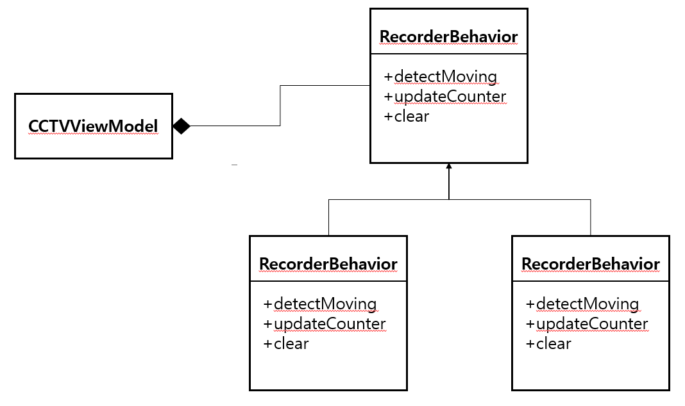
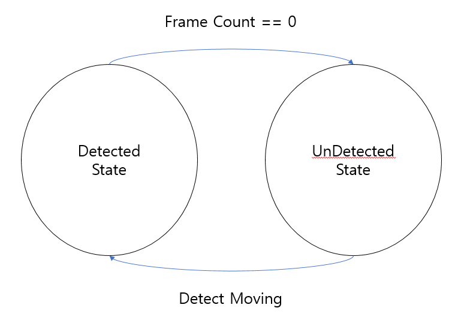
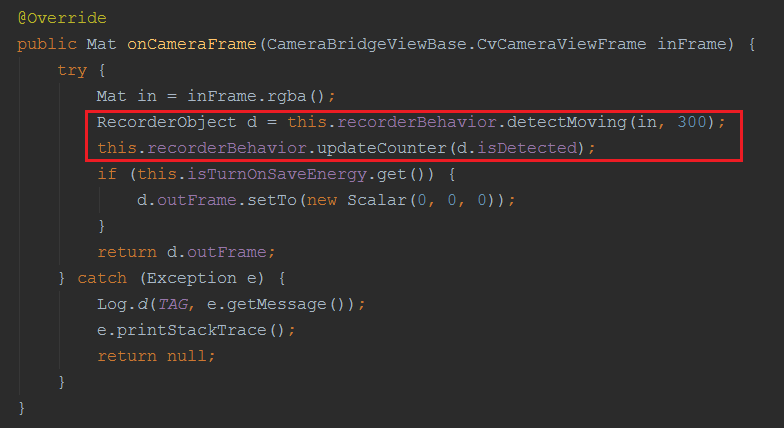
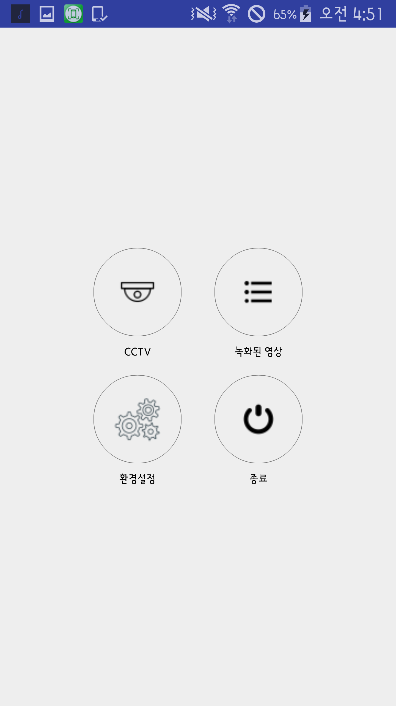
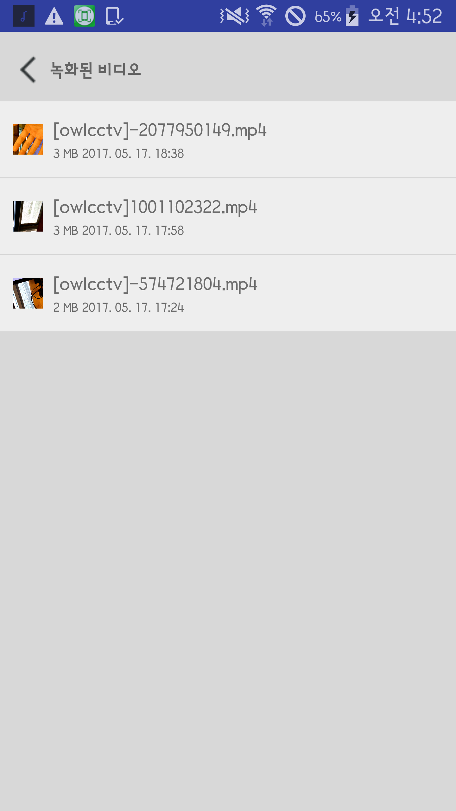
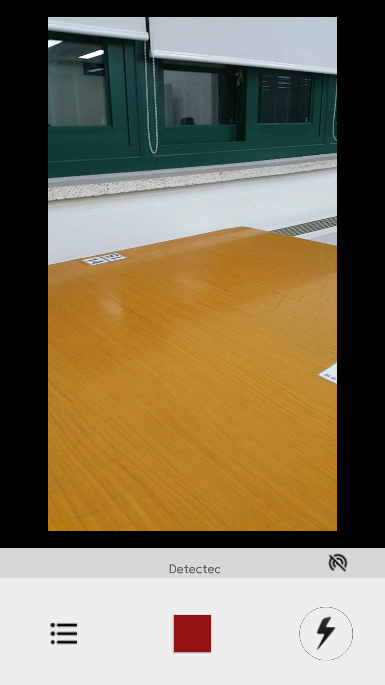
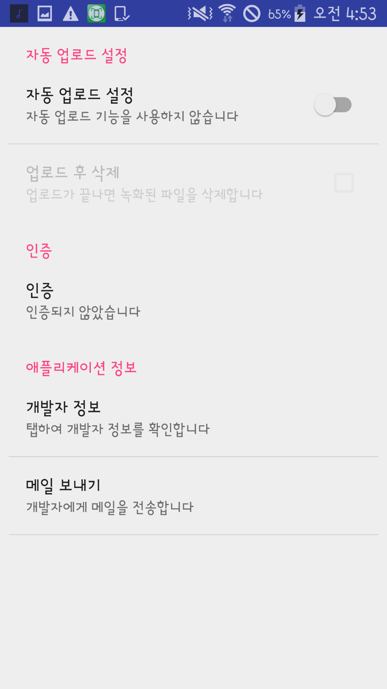
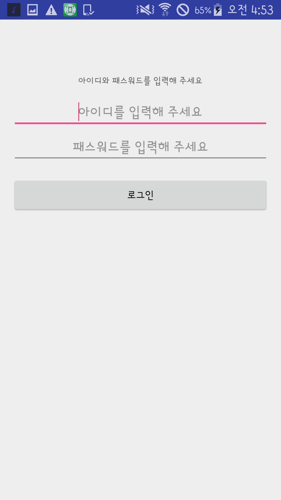
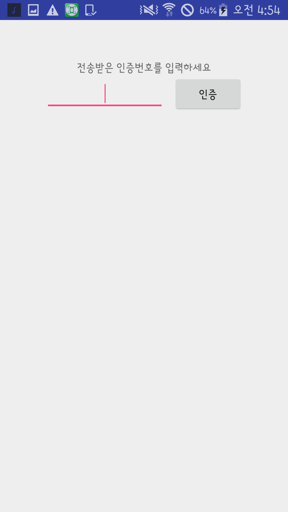

# OwlCCTV 

### Overview
##### OwlCCTV는 Java/Android로 작성된 모바일 움직임 감지 CCTV.   움직임이 검출되면 영상을 녹화하고 저장한 뒤 발급받은 토큰을 사용하여 클라우드 서버로 전송한다

### Features
- OpenCV를 사용하여 움직임 검출
- Azure SDK를 사용하여 클라우드 서버로 녹화된 비디오 전송
- FFmpeg를 사용하여 avi 비디오를 mp4 비디오로 변환
- MVVM 디자인패턴 적용

### 디자인 패턴이 적용된 부분
###### 경로: app/com/duck/owlcctv/viewmodel/CCTVViewModel

#### UML 다이어그램

#### 상태 변경도

- Detected 상태인 경우 제한된 프레임이 모두 입력되면 UnDetected 상태로 변경된다 
- 이 때, 제한된 프레임이 0이 되기 전에 움직임이 감지되면 입력받을 수 있는 프레임의 수가 연장된다
- UnDetected 상태인 경우 움직임이 감지되면 바로 Detected 상태로 변경된다

#### 적용 결과

- 복잡한 if-else if-else 구조에서 간결한 코드로 작성되었다

### 화면구성
##### Main 화면 / 비디오 리스트 화면
 

##### CCTV 모드 화면 / 환경설정 화면
 

##### 로그인 화면
 

